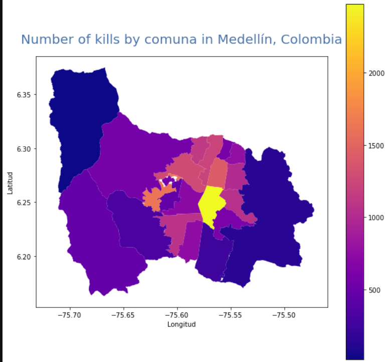

# Integration open data

This is the final project of the udacity's
[Data Engineering Nanodegree Program](https://www.udacity.com/course/data-engineer-nanodegree--nd027?utm_source=gsem_brand&utm_medium=ads_r&utm_campaign=12908423264_c_individuals&utm_term=123085792713&utm_keyword=nanodegree%20data%20engineer_e&gclid=CjwKCAjws8yUBhA1EiwAi_tpERI2Q4lWT-GS2_nJVLj272T1eeszn_Ow11sOMNzrOseyS89JrYxLHhoCnlEQAvD_BwE).  
  
In this project, information of homicides and thefts in the city of Medellin
are integrated with the information of the postal codes.  

The code separates in an ETL process which extracts data of homicides and
steals from  [medata](http://medata.gov.co/) with data of political divisions
of the city downloaded from
[datos.gov](https://www.datos.gov.co/Ordenamiento-Territorial/)
and load them into a Postgres Database.  
  
By using Kimball's data modeling technique [[1]](#1) dimensions and fact tables
are createda and saved into the star schema.

In the end data scientists and analysts will easily produce reports such as
[example notebook](science/demonstration.ipynb)


## Code structure
📦data  
📦etl (Extraction, transformation and loading processes)  
📦science (Some demonstrations of what can be done with the data)  
📜.env (database environment variables)  
📜README.md (This file)  
📜environment.yml (Python environment)  


## Developing

For developing, we have the following requirements.
- [Anaconda](https://www.anaconda.com/) for Python environment.
- [A Postgres database](https://www.postgresql.org/) (It can be a local or cloud database or a data warehouse as Amazon Redshift).  
  
Define the database environment variables described in `.env.example`.
For this, you could save this file as `.env` with the correct credentials and
run `export $(cat ../.env | xargs)` or define manually this variables.  
  
To create and use the anaconda environment
```bash
conda env create -f environment.yml
conda activate medata_integration
```

## Considerations

### Data considerations

- Age is considered as a dimension by itself to allow future flexibility and
possible roll-ups

### Staging

Since actually this project does not have any funding, using the local
filesystem is prefered. However, when someone else joins the project
this staging zone will be to be migrated to the cloud. Something like an `S3`
in aws.

### Data warehouse

Since the data used is not massive, 113,2 MB approx in total and we
do not plan to have a lot of queries over the data.

An AWS RDS with postgresql was prefered to be the database. This is because
RDS is much cheaper than Redshift. However, there are multiple cases in which
we could change the RDS by a Redshift database. Some cases are
- The data was increased by 100x.
- The database needed to be accessed by 100+ people.
  
This change from Postgres to Redshift do not require a lot of modifications
in code.

### Transformation

The transformation is done by [pandas](https://pandas.pydata.org/). However,
in case the datasets get very big and the process gets slower, we could change
this for [apache spark](https://spark.apache.org/)

### Orchestration

Now, the project is executed manually. But in case the information of the
homicides and Thefts needs to be accessed manually. This etl process could
easily be adapted to an orchestration tool such as Airflow or
AWS step functions which could run the pipelines would be run
on a daily basis by 7 am every day.


## Data
All data referenced in this project is from Medellín, Colombia.

- [Thefts recorded by the National Police committed against people in public spaces. (Medata)](http://medata.gov.co/dataset/hurto-persona)
- [Homicides registered by the review and validation table for homicide cases. (Medata)](http://medata.gov.co/dataset/homicidio)
- [TMap of Postal Codes - Municipality of Medellín (datos.gov)](https://www.datos.gov.co/Ordenamiento-Territorial/Mapa-de-C-digos-Postales-Municipio-de-Medell-n/9z4i-tgzy)
- [Geomedellin comunas](https://geomedellin-m-medellin.opendata.arcgis.com/datasets/7a8ad9f85799453e9dab4dc0c8c80bb3_3/api)


## Future

- Integrate neighborhood data. We could use the data in (Arcgis medellin.gov.co)[https://www.medellin.gov.co/mapas/rest/services/ServiciosPlaneacion/POT48_Base/MapServer]
- Create dim_date and dim_hour as suggested in [[1]](#1)

## References

<a id="1">[1]</a>M. Ross and R. Kimball, The data warehouse toolkit. Hoboken, N.J.: Wiley, 2013.
